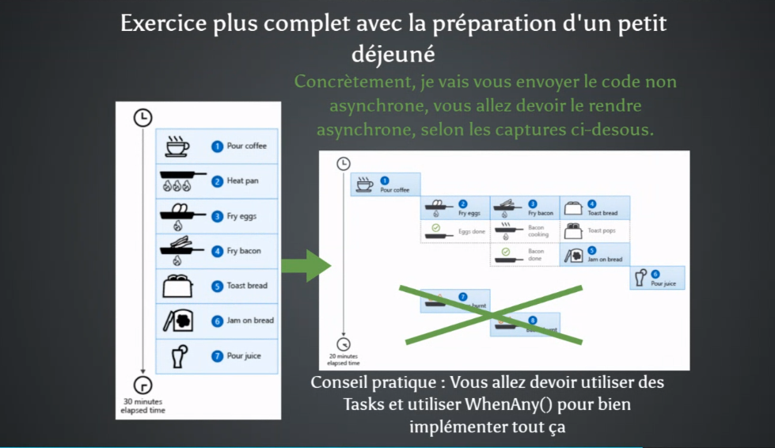

Bien sûr, voici un énoncé d'exercice simple pour le projet AsyncBreakfastPrep, que vous pouvez placer dans un fichier séparé dans le dossier Docs :

Exercice : Préparation Asynchrone du Petit Déjeuner
Objectif
L'objectif de cet exercice est de comprendre et d'appliquer les concepts de programmation asynchrone en C#. Vous allez modifier un programme (/Docs/Program.cs ) de préparation de petit déjeuner synchrone pour qu'il exécute ses tâches de manière asynchrone. Cela implique l'utilisation de async, await, et Task.WhenAny().

Description:
