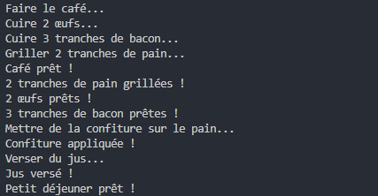

AsyncBreakfastPrep

Description:

AsyncBreakfastPrep est un projet C# conçu pour illustrer l'application de la programmation asynchrone et parallèle dans un contexte pratique. Le projet simule la préparation d'un petit déjeuner, où chaque élément (café, œufs, bacon, toast, et jus d'orange) est préparé en utilisant des tâches asynchrones. Cela démontre comment différentes tâches peuvent être exécutées simultanément, améliorant l'efficacité et réduisant le temps total de préparation.

Objectifs d'Apprentissage:
Comprendre les principes fondamentaux de la programmation asynchrone.
Appliquer les méthodes asynchrones et Task en C#.
Utiliser Task.WhenAny pour synchroniser les tâches parallèles.
Observer les avantages de l'exécution asynchrone dans des scénarios de la vie réelle.

Prérequis:
Environnement de développement .NET (comme Visual Studio)
Connaissance de base de la programmation C#
Installation et Exécution
Clonez ou téléchargez le répertoire AsyncBreakfastPrep.
Ouvrez le projet dans Visual Studio ou tout autre IDE supportant C#.
Compilez et exécutez le projet pour observer la préparation du petit déjeuner en mode asynchrone.

Fonctionnement:
Le programme initie plusieurs tâches asynchrones, chacune représentant une partie de la préparation du petit déjeuner. Chaque tâche a un délai différent, simulant le temps nécessaire pour préparer chaque élément. Task.WhenAny est utilisé pour attendre et traiter chaque tâche à mesure qu'elle se termine.

Console:
